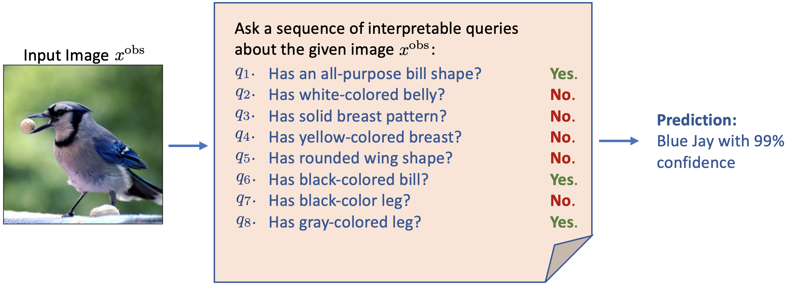
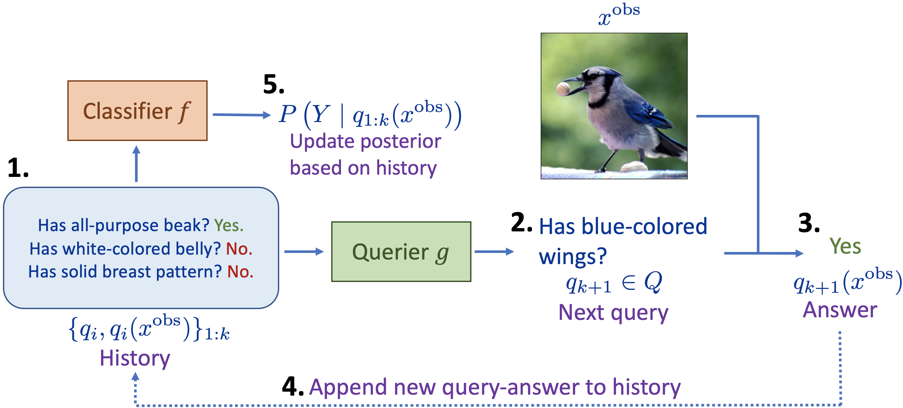

# Variational Information Pursuit for Interpretable Predictions
**Aditya Chattopadhyay, Kwan Ho Ryan Chan, Benjamin D. Haeffele, Donald Geman, René Vidal** <br>
***Mathematical Institute for Data Science, Johns Hopkins University*** <br>
**`{achatto1, kchan49, bhaeffele, geman, rvidal}jhu.edu`**

This is the offical repository for *Variational Information Pursuit for Interpretable Predictions (2022)*. I am last updated on 16 October 2022. For our paper, please visit [link]().


## Overview
<p align="center">

</p>

There is a growing interest in the machine learning community in developing
predictive algorithms that are “interpretable by design”. Towards this end, recent work proposes to make interpretable decisions by sequentially asking interpretable queries about data until a prediction can be made with high confidence based on the answers obtained (the history). To promote short query-answer
chains, a greedy procedure called Information Pursuit (IP) is used, which adaptively chooses queries in order of information gain *(See Figure above)*. Generative models are employed to learn the distribution of query-answers and labels, which is in turn used to estimate the most informative query. However, learning and inference with a
full generative model of the data is often intractable for complex tasks. In this work, we propose Variational Information Pursuit (V-IP), a variational characterization of IP which bypasses the need for learning generative models. V-IP is based on finding a query selection strategy and a classifier that minimizes the expected cross-entropy between true and predicted labels. We then demonstrate that the IP strategy is the optimal solution to this problem. Therefore, instead of learning generative models, we can use our optimal strategy to directly pick the most informative query given any history. We then develop a practical algorithm by defining a finite-dimensional parameterization of our strategy and classifier using deep networks and train them end-to-end using our objective. A pipeline of our framework is shown below.
<p align="center">

</p>

## Requirements
Please check out `requirements.txt` for detailed requirements. Overall, our code uses basic operations and do not require the latest version of PyTorch or CUDA to work. We also use `wandb` to moderate training and testing performance. One may remove lines related to `wandb` and switch to something different if they desire. 


## Training
There are two stages of training: *Initial Random Sampling (IRS)* and *Subsequent Biased Sampling (SBS)*.

To run IRS:

```
python3 main_mnist.py \
  --epochs 100 \
  --data mnist \
  --batch_size 128 \
  --max_queries 676 \
  --max_queries_test 21 \
  --lr 0.0001 \
  --tau_start 1.0 \
  --tau_end 0.2 \
  --sampling random \
  --seed 0 \
  --name mnist_random
```

To run SBS:

```
python3 main_mnist.py \
  --epochs 20 \
  --data mnist \
  --batch_size 128 \
  --max_queries 21 \
  --max_queries_test 21 \
  --lr 0.0001 \
  --tau_start 0.2 \
  --tau_end 0.2 \
  --sampling biased \
  --seed 0 \
  --ckpt_path <CKPT_PATH> \
  --name mnist_biased
```
where `<CKPT_PATH>` is the path to the pre-trained model using IRS.
## License


## Cite
If you find our work useful for your research, please cite:

```
arxiv
```

